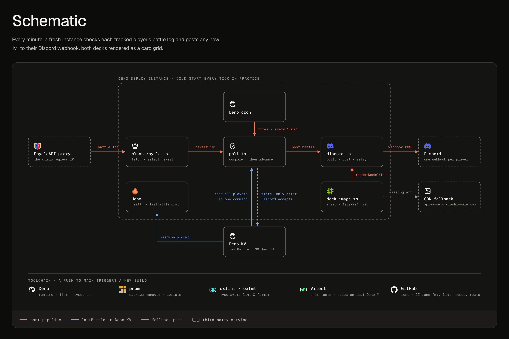

# stalk

Watches Clash Royale players and posts their matches to Discord.

A [Deno](https://deno.com/) app (deployed on [Deno Deploy](https://deno.com/deploy), built with
[Hono](https://hono.dev/)) that polls one or more players' battle logs every minute and posts each
new result to that player's own webhook. The message text carries the outcome, crown score, and HP
margin. Below it sits one embed per side, with trophies, tower troop, and the full deck rendered as
a card-image grid.

<a href="docs/architecture-dark.png">
	<picture>
		<source media="(prefers-color-scheme: dark)" srcset="docs/architecture-dark.png">
		<source media="(prefers-color-scheme: light)" srcset="docs/architecture-light.png">
		
	</picture>
</a>

## How it works

1. `Deno.cron` fires every minute and polls every tracked player concurrently. One player's failure
   can't sink the others, and each tick ends with a one-line tally
   (`posted` / `seeded` / `skipped` / `drifted` / `failed`).
2. `clash-royale.ts` fetches the battle log through the
   [RoyaleAPI proxy](https://docs.royaleapi.com/#/proxy), which provides the stable outbound IP that
   the Clash Royale API token is whitelisted against. Deno Deploy has none of its own.
3. `poll.ts` compares the newest eligible battle's timestamp against a lastBattle value in Deno KV.
   Each player gets its own key, `["lastBattle", tag]`, with a 30-day TTL, so entries for players
   you stop tracking clean themselves up.
4. **First run:** `poll.ts` seeds lastBattle without posting, so you don't get a notification about
   a battle from last week.
5. **After that:** it posts the new battle to the webhook, and only then advances lastBattle. If the
   post succeeds but the write fails, the next tick re-posts rather than dropping the battle. A rare
   duplicate beats a silent loss.

`src/schema.ts` ignores 2v2 and Duel battles (a Duel concatenates 2–3 decks into one battle, not a
single 1v1 loadout). The log arrives newest-first, so the first entry to pass a cheap 1v1 check, one
team entry holding at most one deck, is the newest one, and the scan stops there. Only that entry is
fully validated, so validation runs once per log rather than once per entry.

The scan skips an entry that fails the cheap check. If the newest eligible entry then fails full
validation, that's `drifted` rather than `skipped`: lastBattle stays put so the battle retries once
the schema catches up, instead of the tick reading as a quiet one.

**At most one battle posts per tick, and it is the newest one.** A player who finishes several
battles between ticks has the intermediate ones skipped; lastBattle jumps straight to the newest.
That's deliberate: it keeps a tick to a single fetch, a single validation, and a single post per
player.

## Setup

### Prerequisites

- [Deno](https://deno.com/) 2.x
- A [Clash Royale API](https://developer.clashroyale.com/) token, whitelisted to the
  [RoyaleAPI proxy](https://docs.royaleapi.com/#/proxy) IP
- A Discord channel [webhook URL](https://support.discord.com/hc/en-us/articles/228383668) per
  player you want to track

### 1. Install

```sh
deno install
```

### 2. Configure

Copy `.env.example` to `.env` (gitignored) and fill it in:

```sh
cp .env.example .env
```

```sh
CR_API_TOKEN=...
TARGETS='[{ "tag": "#A9AA008R", "webhook": "https://discord.com/api/webhooks/aaa/bbb" }]'
```

`TARGETS` is a JSON array pairing each player tag (keep the leading `#`) with the webhook to notify.
Add as many as you like:

```json
[
	{ "tag": "#A9AA008R", "webhook": "https://discord.com/api/webhooks/aaa/bbb" },
	{ "tag": "#P7BB114L", "webhook": "https://discord.com/api/webhooks/ccc/ddd" }
]
```

> **Wrap the `TARGETS` value in single quotes.** The `#` in a player tag would otherwise start a
> comment and silently truncate the value.

A malformed `TARGETS` fails soft: it logs once and polls nobody, instead of throwing on every tick.
A missing `CR_API_TOKEN` skips each tick with a heartbeat log, so a misconfigured deploy keeps
writing a line every minute instead of going quiet.

### 3. Run locally

```sh
deno task dev
```

Runs with `.env` loaded, serving `GET /` (health check) and `GET /kv/last-battle` (a read-only dump
of the stored lastBattle values). `-P` loads the `default` permission set from `deno.jsonc` instead
of prompting per-permission. `Deno.cron` registers at startup and fires on the minute against Deno's
local scheduler.

That permission set's `net.allow` list is the one entry worth knowing about, since a host missing
from it stops the dev server on a permission prompt rather than failing fast. Where each entry comes
from:

| Host                         | Source                                                                                   |
| ---------------------------- | ---------------------------------------------------------------------------------------- |
| `0.0.0.0:8000`               | `Deno.serve`'s default bind — `src/main.ts` sets no port                                 |
| `proxy.royaleapi.dev`        | `PROXY_BASE` in `src/clash-royale.ts`                                                    |
| `discord.com`                | the `webhook` host in your `TARGETS`                                                     |
| `api-assets.clashroyale.com` | the host inside the API's `iconUrls`, fetched by the CDN fallback in `src/deck-image.ts` |

Two caveats. `TARGETS` only validates that the webhook is a URL, so a webhook on `ptb.discord.com`,
`canary.discord.com`, or `discordapp.com` needs its host added by hand. And this is a dev-only
convenience. Deno Deploy never loads it, `deno task test` runs without `-P`, and `ffi` is open in
the same set (sharp's libvips addon needs it, and native code runs outside Deno's permission
system). The list catches an unnoticed new outbound host. It is not a security boundary.

### 4. Deploy

Set `CR_API_TOKEN` and `TARGETS` in the Deno Deploy project (dashboard), then connect the project to
this GitHub repo. Deno Deploy builds and deploys on every push, so there's no local deploy command.
It also provisions Deno KV and `Deno.cron` for you, with no namespace to create. The `images/` card
art lives in the repo and ships with it; the renderer depends on it in production.

## Commands

```sh
deno task dev     # Local dev server

deno task test     # Vitest suite
deno task preview  # Render a hardcoded deck to scripts/preview.png, for eyeballing layout changes
deno task measure  # Report the transparent margins baked into the card icons

deno task fmt         # Format (oxfmt)
deno task lint        # oxlint && deno lint && deno check
deno task lint-agent  # Same three checks, oxlint in --format=agent
deno task sync-types  # Regenerate the vendored deno.d.ts, after a Deno version change
```

`deno task lint` covers linting _and_ typechecking. There's no separate `tsc` step. CI runs install,
format check, lint, and test on every pull request and every push to `main`.

## Configuration reference

| Name           | Kind     | Purpose                                                                      |
| -------------- | -------- | ---------------------------------------------------------------------------- |
| `CR_API_TOKEN` | Env var  | Bearer token for the Clash Royale API, whitelisted to the RoyaleAPI proxy IP |
| `TARGETS`      | Env var  | JSON array of `{ tag, webhook }` pairs, one per tracked player               |
| Deno KV        | KV store | Holds the `["lastBattle", tag]` values, 30-day TTL                           |

`src/env.ts` reads and validates both env vars once at module load, from `.env` locally and from the
project settings in production. KV holds nothing secret, which is why the lastBattle route is safe
to expose.

## Project layout

```
stalk/
├── src/                    # application code — see the table below
│   ├── __mocks__/          # manual module mocks for vi.mock
│   └── testing/            # KV spy + raw API fixtures
├── images/                 # 180 card-art PNGs, keyed by card id (plus -evo/-hero variants)
├── scripts/
│   ├── preview.ts          # deno task preview — render a deck to preview.png
│   └── measure.ts          # deno task measure — card icons' transparent margins
├── docs/
│   └── deck-rendering.md   # every deck constant's value and rationale
├── .github/
│   └── workflows/
│       └── ci.yml          # install, fmt --check, lint, test — on PRs and main
├── deno.jsonc              # tasks, dev permission set, @/ alias, Deno compilerOptions
├── package.json            # runtime deps (the @/ alias is the only import in deno.jsonc)
├── deno.lock
├── deno.d.ts               # vendored Deno types, for oxlint (deno task sync-types)
├── tsconfig.json           # read by oxlint/tsgolint, not by Deno
├── oxlint.config.ts
├── oxfmt.config.ts
└── vitest.config.ts
```

The `src/` modules, each with a `*.test.ts` beside it:

| Module            | Role                                                                                    |
| ----------------- | --------------------------------------------------------------------------------------- |
| `main.ts`         | Entry point: HTTP routes, cron registration, per-tick tally                             |
| `poll.ts`         | The polling loop — lastBattle read/compare/advance, one outcome per player              |
| `clash-royale.ts` | Battle-log fetch and newest-eligible-battle selection                                   |
| `discord.ts`      | Webhook message construction and delivery, with a text-only fallback                    |
| `deck-image.ts`   | Deck grids composited from local card art via [sharp](https://sharp.pixelplumbing.com/) |
| `schema.ts`       | Valibot schemas for the API shapes and the env vars                                     |
| `env.ts`          | Env vars read and validated once at module load                                         |
| `log.ts`          | Leveled, colored console output                                                         |

`src/deck-image.ts` composites deck grids from the local `images/` mirror rather than fetching per
render, and ships them at native resolution with no downscale step. An 8-card grid is 1080 px wide
and about 3.28 MiB, stored uncompressed to keep encode CPU down. Nothing is cached between renders:
Deno Deploy gives the app a fresh isolate every tick, so there is no state for a cache to live in.
A CDN fetch is the fallback for a card too new to be in the mirror; if rendering fails outright, the
battle still posts as a text-only embed.

Working on the code? `.claude/CLAUDE.md` documents the toolchain setup, the guarantees, and the
traps. [`docs/deck-rendering.md`](docs/deck-rendering.md) documents every deck-rendering
constant's value and rationale.
