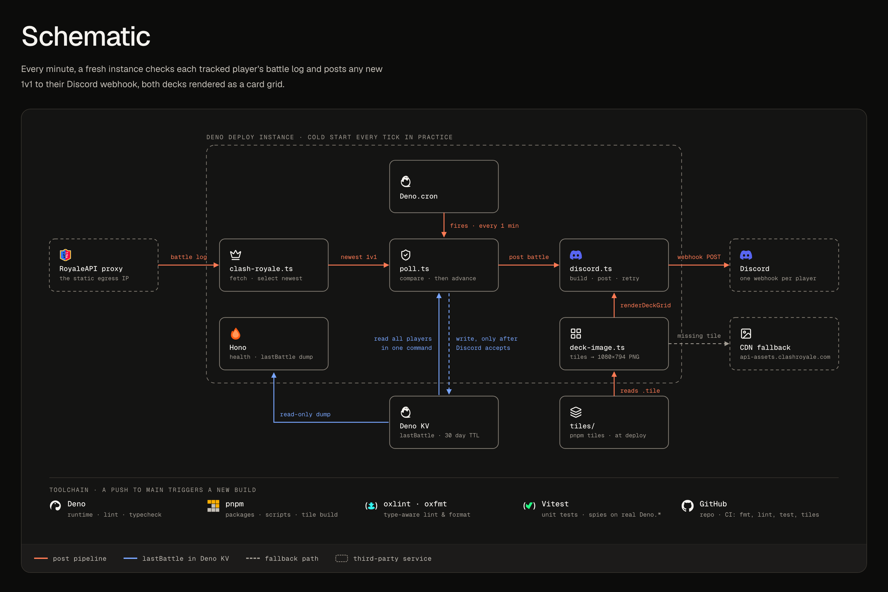

# stalk

Posts Clash Royale players' battles to Discord.

stalk is a [Deno](https://deno.com/) app for [Deno Deploy](https://deno.com/deploy). Once a minute it
checks the battle log of every player you track and posts each player's newest 1v1 to that player's
Discord webhook, with both decks drawn as card grids.

<a href="docs/architecture-dark.png">
	<picture>
		<source media="(prefers-color-scheme: dark)" srcset="docs/architecture-dark.png">
		<source media="(prefers-color-scheme: light)" srcset="docs/architecture-light.png">
		
	</picture>
</a>

## What a post contains

The message text is the result, the score and the HP margin, and it is also what the push
notification shows:

```
# Victory
## Alice  2 — 1  Bob
Won by 1,400hp
```

The margin is the HP of the winner's weakest tower still standing. A draw has no margin line.

Below the text are two embeds, one for each player. Each embed has:

- the player's name, linked to their battle history on [RoyaleAPI](https://royaleapi.com/);
- their deck, as a 1080×794 image of the eight cards in two rows;
- their trophies before and after the battle, when the API reports them;
- their tower troop as the thumbnail;
- the game mode and the battle's time.

If a deck image can't be rendered, or Discord rejects the upload, the battle posts as a single
embed that lists both decks and tower troops as text.

## How it works

Every minute, `Deno.cron` runs a tick:

1. Read every player's stored lastBattle, the time of the last battle handled, from Deno KV in a
   single command.
2. For each player, at the same time: fetch the battle log from the Clash Royale API through the
   [RoyaleAPI proxy](https://docs.royaleapi.com/proxy.html). The official API only accepts a token
   from the IP addresses it was created for, and Deno Deploy has no fixed outbound IP, so the token
   is created for the proxy's address instead.
3. Take the first 1v1 in the log, which arrives newest first. 2v2s and Duels are skipped. Only this
   entry is fully validated.
4. Compare its time with the stored lastBattle:
   - Nothing stored, for a new player or one inactive for 30 days: store the time without posting.
     Adding a player never posts an old battle.
   - The same time: nothing to do.
   - A newer time: post the battle to the webhook, then store the time.
5. Log one line per tick that counts each outcome: `posted`, `seeded`, `skipped`, `drifted` and
   `failed`.

Delivery rules that follow from this:

- A player gets at most one post per tick, for their newest battle. If they finish two battles
  within a minute, only the second one posts.
- lastBattle is written only after the post succeeds. A failed post is retried on the next tick. If
  the post succeeds but the write fails, the next tick posts the battle again: a duplicate is
  preferred over a lost battle.
- If the newest 1v1 doesn't match the expected schema, the tick reports `drifted` and logs the
  validation issues. Nothing posts, and the battle is retried every tick until the schema in
  `src/schema.ts` is fixed.
- One player's failure doesn't affect the others.

## Setup

### Prerequisites

- [pnpm](https://pnpm.io/) 12. `package.json` pins pnpm 12.6.0 and Deno 2.9.6 in `devEngines`, and
  pnpm downloads that Deno into `node_modules`, so you don't need Deno installed.
- A [Clash Royale API](https://developer.clashroyale.com/) token, created for the IP address listed
  in the [RoyaleAPI proxy docs](https://docs.royaleapi.com/proxy.html).
- A [Discord webhook URL](https://support.discord.com/hc/en-us/articles/228383668) for each player
  you want to track. Several players can share one.

### Install

```sh
pnpm install
```

### Configure

```sh
cp .env.example .env
```

Fill in `.env`:

```sh
CR_API_TOKEN=...
TARGETS='[{ "tag": "#A9AA008R", "webhook": "https://discord.com/api/webhooks/aaa/bbb" }]'
```

`TARGETS` is a JSON array with one entry per player:

```json
[
	{ "tag": "#A9AA008R", "webhook": "https://discord.com/api/webhooks/aaa/bbb" },
	{ "tag": "#P7BB114L", "webhook": "https://discord.com/api/webhooks/ccc/ddd" }
]
```

Keep the single quotes around the `TARGETS` value. Without them, the value ends at the `#` of the
first tag. Tags are case-insensitive, and the `#` is optional.

A missing or invalid `TARGETS` is logged and polls nobody. A missing `CR_API_TOKEN` logs a warning
on every tick and skips it.

### Run locally

```sh
pnpm start
```

This starts the server on port 8000 with `.env` loaded and registers the cron job with Deno's local
scheduler, which fires on the minute. Two routes are available:

- `GET /` returns `{ "status": "ok" }`.
- `GET /kv/last-battle` returns every stored lastBattle value by tag. KV holds only player tags and
  battle times, so the route has no authentication.

Locally, KV data lives in Deno's cache directory and persists between runs.

`pnpm start` runs Deno with `-P`, which applies the `default` permission set in `deno.jsonc`. Its
network allowlist covers the local server, `proxy.royaleapi.dev`, `discord.com` and
`api-assets.clashroyale.com`, the CDN for card art that `images/` doesn't have. A webhook on another
host, such as `ptb.discord.com` or `discordapp.com`, needs that host added; otherwise Deno prompts
for permission in a terminal and refuses the request elsewhere. Deno Deploy ignores this set and
runs the app with every permission.

### Deploy

1. In the [Deno Deploy console](https://console.deno.com/), create an app from this GitHub
   repository. `deno.jsonc` supplies the build settings: install with
   `pnpm install --frozen-lockfile -P`, then run `src/main.ts`.
2. Under Databases, provision a Deno KV database and assign it to the app.
3. Add `CR_API_TOKEN` and `TARGETS` as environment variables in the Production context only.

Each push to the default branch then deploys. The card art in `images/` ships with the code, and
the renderer reads it from there.

Deno Deploy gives every Git branch its own timeline, with its own KV database, and runs the cron
job on each one. Branch timelines use the Development context, so with the variables set only for
Production, a branch deployment skips every tick instead of posting battles a second time.

On the free tier, one tick a minute is about 43,800 ticks a month. Each tick is one cron request
and one KV read, well within the free quotas of 1,000,000 requests and 1,000,000 KV read units.

## Commands

```sh
pnpm start       # Run locally with .env
pnpm test        # Run the Vitest suite
pnpm fmt         # Format with oxfmt (pnpm fmt --check to verify)
pnpm lint        # oxlint, deno lint and deno check (type checking included)
pnpm lint-agent  # The same checks, with oxlint output formatted for AI agents
pnpm preview     # Render a sample deck to scripts/preview.png
pnpm measure     # Print the transparent margins of the card art in images/
pnpm sync-types  # Regenerate deno.d.ts after changing the Deno version
```

CI runs `pnpm fmt --check`, `pnpm lint` and `pnpm test` on every pull request and every push to
`main`.

## Configuration

| Name           | Where   | Purpose                                                        |
| -------------- | ------- | -------------------------------------------------------------- |
| `CR_API_TOKEN` | Env var | Clash Royale API token, created for the RoyaleAPI proxy's IP   |
| `TARGETS`      | Env var | JSON array of `{ tag, webhook }`, one entry per tracked player |
| lastBattle     | Deno KV | Key `["lastBattle", tag]`: the time of the last handled battle |

Each lastBattle entry expires 30 days after its last write, so a player removed from `TARGETS`
leaves nothing behind in KV.

## Project layout

```
src/
├── main.ts            Entry point: HTTP routes, the cron job, the per-tick tally
├── poll.ts            One tick: read lastBattle, poll each player, post, write lastBattle
├── clash-royale.ts    Fetches a battle log and picks the newest 1v1
├── discord.ts         Builds and posts the webhook message, with the text-only fallback
├── deck-image.ts      Renders a deck as a PNG grid with sharp
├── schema.ts          Valibot schemas for the API responses and the env vars
├── env.ts             Reads and validates CR_API_TOKEN and TARGETS
├── log.ts             Leveled, colored console output
├── testing/           Raw API fixtures and the in-memory KV spy
└── __mocks__/         The manual Vitest mock for log.ts
images/                Card art: <id>.png, <id>-evo.png and <id>-hero.png, all 285×420
scripts/
├── preview.ts         pnpm preview: renders a sample deck to scripts/preview.png
└── measure.ts         pnpm measure: prints the card-art margins behind the grid constants
docs/                  The architecture diagram, in light and dark versions
```

The modules in `src/` are listed in call order, from the cron job down to the renderer, followed by
the modules they all share. Each one has a `*.test.ts` file beside it, and its comments explain
each constant and design choice, including the measurements that support them.

Configuration at the repository root:

- `package.json` declares the dependencies and the `pnpm` scripts, and pins pnpm and Deno in
  `devEngines`. `pnpm-lock.yaml` and `pnpm-workspace.yaml` are pnpm's lockfile and settings.
- `.npmrc` resolves the `@jsr` scope from `npm.jsr.io`, where the `@std/*` packages come from.
- `deno.jsonc` holds Deno's compiler options, the unstable KV and cron APIs, the `@/` import alias,
  the permission set `pnpm start` uses, and the Deno Deploy build settings.
- `tsconfig.json` is the TypeScript config for oxlint's type-aware rules, and Vitest takes the `@/`
  alias from its `paths`. `deno check` reads `deno.jsonc` instead.
- `deno.d.ts` is a copy of Deno's type declarations, so that oxlint can resolve `Deno.*`.
  `pnpm sync-types` regenerates it.
- `oxlint.config.ts`, `oxfmt.config.ts` and `vitest.config.ts` configure linting, formatting
  (import order included) and tests.
- `.github/workflows/ci.yml` installs dependencies through Socket Firewall, then checks formatting,
  lints and runs the tests.
- `.env.example` is the template for `.env`, and `.vscode/settings.json.example` sets up the Deno
  and Vitest extensions in VS Code.
- `.claude/`, `.agents/skills/` and `skills-lock.json` hold instructions and skills for AI coding
  agents. `.claude/skills/` links into `.agents/skills/`, and `skills-lock.json` records where each
  skill came from.
